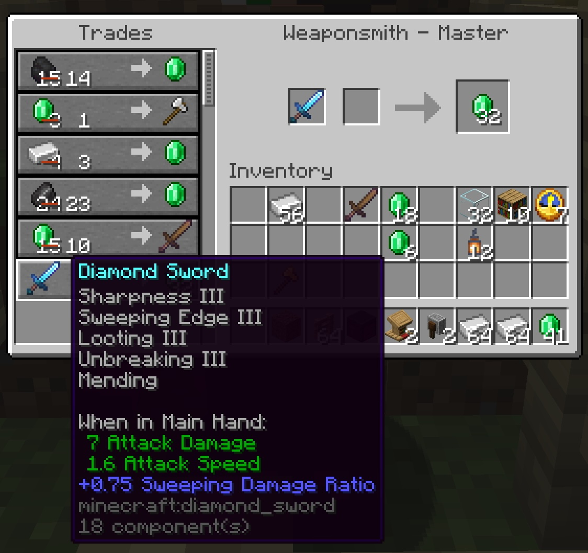

# _Trade School_ for Minecraft Villagers

## Background

### Vanilla Librarian Trading

Since 1.14, the "Village & Pillage" update, Minecraft villagers become
specialised in different professions, each offering unique trades. One of the
most valuable is the Librarian villager, who can offer enchanted books.

When a villager becomes a Librarian -- when they claim a lectern as a job
site -- they are allocated two random trades, one of which may be an enchanted
book. The enchantment, both type and level, is chosen randomly, and the price
is also random within a particular range.

Once a player has traded with a Librarian, those trades and the villager's
profession are locked in. The villager can level up through trading, unlocking
more trades, but the initial trades remain the same.  As they level up, their
new trades are randomly generated and locked-in immediately, so often an Expert
Librarian's advanced trades aren't valuable.

Thing is, there's a legal hack to reset a Novice Villager's trades: simply break
and replace their job site block. This allows you to "reroll" their trades until
you get the one you want.  Once you have the desired trade, lock it in by
trading with them in any way.

If you trap a villager in a hole (use a bed or even a Lectern… easy) and put an
enchanted axe with Efficiency in your off-hand and a Lectern in your main hand,
you can get into a rhythm: place the Lectern, see the trades, hit "F" to switch
axe into main hand, break the Lectern, hit "F" _immediately_ to switch axe back
into off-hand so the dropped Lectern goes into your main hand, and repeat.

With patience and some (annoying) villager wrangling, you can easily get a set
of Librarians that offer the most overpowered books in the game, and with even
more patience you can get them at low prices.  With zombification and curing,
you can even get them to offer their trades at a significant discount.

Couple this with a simple Iron Farm (eg. IanXOFour's Day One Iron Farm design)
and a few armourers, weaponsmiths and toolsmiths to whom to sell the iron, you
can cheese the game in a few hours without leaving a starter village… all
Diamond armour, tools and weapons with the best enchantments, and a good supply
of Golden Carrots from Master Farmers to boot.

Clearly this is not how the game was intended to be played.

### Villager Trade Rebalance experiment

For 1.20.2, Mojang introduced an experimental "Villager Trade Rebalance"
feature, which changes how villager trades are generated. With this feature
enabled, Librarians' trades are determined by their home biome, so to get
_Mending_ for example, you need to get a Librarian from a swamp.

In this experiment, the trades are also nerfed with books like _Sharpness V_
and _Efficiency V_ no longer available from Librarians at all, with random
enchantments and treasure being the only way; or building higher-level books by
combining lower-level ones in an anvil, which limits the enchantments that can
be applied to an item in Survival.

The point of this experiment was to reduce the overpowered nature of villager
trades, and to encourage exploration and resource gathering; this is a laudable
goal.

Unfortunately, it's been done in a half-assed way. Even if you have pairs of
villagers from all the biomes and can breed them, there's still a lot of
luck/patience and grinding/re-rolling required to get the best enchantments.
It's not fun; it's tedious.

And, to be honest it's not that much of an adventure: just find the seven biomes
and wrangle villagers.  Or, you can get the books from chests in generated
structures.

### Archaeology and armour trims

Meanwhile, with 1.20, the "Trails & Tales" update, Mojang added the Archaeology
system and trail ruins. This allows players to find and excavate pottery shards,
which can be combined to create decorative pots. In addition, armour trims were
introduced.

This new game mechanic could have been a great way to encourage exploration and
adventure, but in practice it's underwhelming; it's just a tedious grind for
purely cosmetic items with no gameplay benefit.

### Realism

The thing is, none of these things make any real-world sense.  In the standard
experience, why would a villager forget their trades and suddenly learn new
magical ones just because you broke their work site?

Wouldn't Librarians, Academics, and even Artisans _learn_ new skills and trades
through study and practice?

Wouldn't Archaeologists be more interested in uncovering historical artifacts
and knowledge rather than just collecting pottery shards for decoration?

And why would one biome's Librarian know different enchantments than another's?  
Wouldn't knowledge be shared and disseminated?

## Proposal: Trade School

To address these issues, I propose the introduction of a "Trade School" system
for Minecraft villagers. This system would allow villagers to learn and improve
their trades through study and practice, rather than random chance.

### The idea

1. A newly-trading villager has no knowledge of any enchantments. They can only
   trade the basic items associated with their profession (e.g., bookshelves
   and paper)

2. To learn new enchantments, the player must provide the Librarian with
   enchanted books that they wish to learn, or an Armorer/Smith/Fletcher with
   enchanted or customised items. The player can choose which enchantments to
   teach the villager, allowing for strategic planning of trades.

3. Villagers can pick up dropped items, ie. enchanted books or
   enchanted/customised items, if they are within that villager's profession
   and experience.  They will "study" the item to learn how to make it.

4. From that point, the villager can offer that enchanted item as a trade.

5. The level of the enchantments is determined by the villager's level at the
   time of learning it, so a Novice can only offer Level 1 enchantments; you
   sell them a "Power 5" and they'll only be able to sell "Power 1".

6. If they level up, they can learn higher-level enchantments, but their
   existing trades will stay as they are.

7. Low-level random enchantment books may still be found in generated structures
   and villages, fishing, and so on, but with a limit on the level of
   enchantment (eg. max Level 2).

8. Instead, higher-level books need to be found as treasure: in Ancient Cities,
   Bastion Remnants, End Cities, Temples, Trial Chambers, _and Archaeological
   digs_. This encourages exploration and adventure.

9. Archaeologists can find rare enchanted books as part of their excavations,
   providing a new incentive to engage with the Archaeology system.

10. Different biomes will influence the probability of finding certain
    enchantments, but still possible to find any enchantment anywhere.  So,
    for example, _Mending_ books are more likely to be found in swamp biomes,
    but can still be found elsewhere with a (far) lower probability.

11. The more dangerous and/or rare the location, the higher the probability
    of high-level books. Ancient Cities or Bastion Remnants would have a better
    chance of yielding high-level enchanted books than a simple Desert Temple,
    and rare Archaeological sites would have a higher chance of yielding unique
    or powerful enchantments than, say, Ruined Portals or Shipwrecks. So,
    several different variables -- biome, danger level, rarity, enchantment
    type, enchantment level -- would all factor into the probability of finding
    a particular enchanted book at a given location.

12. "Curse of Copyright".  All found enchanted books and items have a chance of
    an additional enchantment that cannot be removed and prevents villagers
    from using that book to learn new trades.  This makes the item useful for
    single items, but the Curse prevents the books or the items enchanted with
    the books from being used for villager training.

### Benefits

The goal here is to massively incentivise exploration and adventure, AND
convert the villager trading activity into a trading- and training-up system
rather than a random re-roll grind.

It'd make Archaeology worth doing, and make Villagers _marginally_ less
annoying to deal with by eliminating the random aspect.

### Implementation

I've implemented a basic mod to demonstrate this idea, called "Trade School" /
"tradeschool". It's just a proof-of-concept for Minecraft (Java) 26+ at
this stage, as I've little experience writing Minecraft mods.

## License and stuff

This mod is covered by the [MIT License](LICENSE.txt).

In short, you may freely use this mod in any modpack, but just don't claim you
made the mod and then sue me for copyright!

The idea's public-domain, and I'm sure others have come up with the same. No 
promises, no warranties, so don't blame me if it breaks anything or disadvantages
you in some way, or you believe it did.

[Comments and improvements welcome.](https://github.com/tomgidden/minecraft-tradeschool)

-- `_gid`

